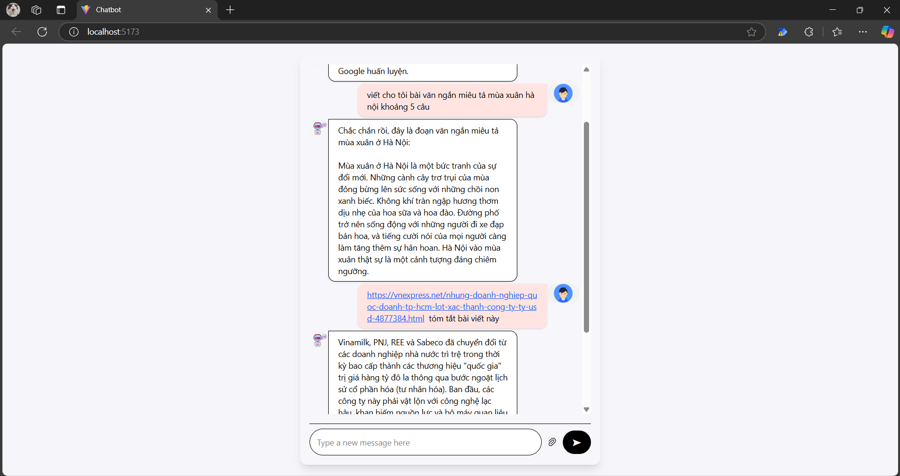

## Các bước run project

#### 1. Cài đặt môi trường và thư viện bằng conda:

```bash
cd ./backend/
```

```bash
conda create -n chatbot-env python=3.11.11 -y
```

```
conda activate chatbot-env
```

```
pip install -r requirements.txt
```

#### 2. Chạy website:

```bash
cd ./frontend/
```

```
npm i
```

```
npm run dev
```
